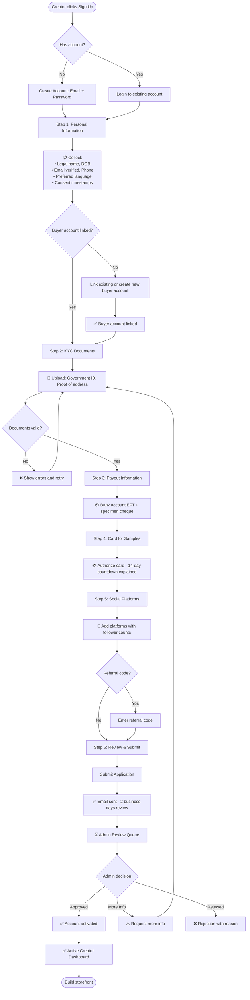
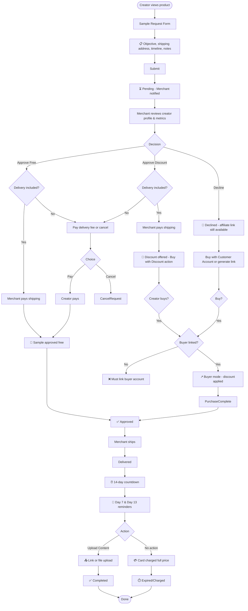
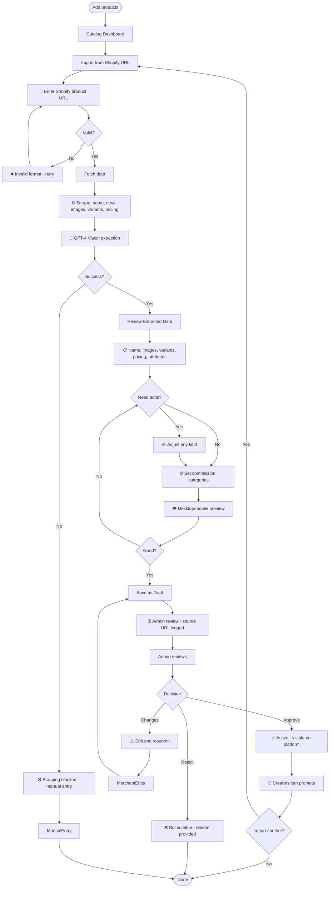
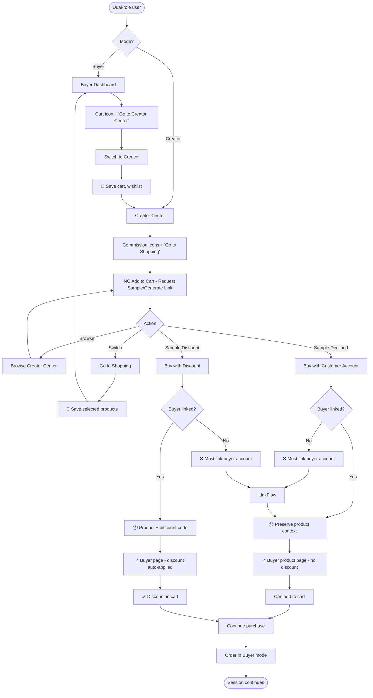

```mermaid
flowchart TD
    Start([Browse products]) --> ProductPage[Product Detail]
    ProductPage --> ViewDetails["Images, price, variants, reviews"]
    ViewDetails --> SelectVariant{Has variants?}
    SelectVariant -->|Yes| ChooseVariant[Select size/color]
    SelectVariant -->|No| AddToCart[Add to Cart]
    ChooseVariant --> AddToCart

    AddToCart --> CartUpdated["🛒 Cart updated - confirmation toast"]
    CartUpdated --> ContinueShopping{Continue?}
    ContinueShopping -->|Yes| ProductPage
    ContinueShopping -->|No| ViewCart[View Cart]

    ViewCart --> CartPage["Items, quantity, subtotal"]
    CartPage --> ProceedCheckout[Checkout]
    ProceedCheckout --> AuthCheck{Logged in?}
    AuthCheck -->|No| GuestOrLogin["Guest email or login"]
    AuthCheck -->|Yes| CheckoutPage
    GuestOrLogin --> CheckoutPage

    CheckoutPage --> AddressSection["📍 Shipping address + validation"]
    AddressSection --> ShippingMethod["🚚 Standard/Express"]
    ShippingMethod --> OrderSummary["💰 Subtotal + Shipping + Taxes + Total CAD"]
    OrderSummary --> DiscountCode{Discount?}
    DiscountCode -->|Yes| EnterCode[Enter code] --> ValidateCode{Valid?}
    ValidateCode -->|No| CodeError --> PaymentMethod
    ValidateCode -->|Yes| DiscountApplied["✅ Applied"] --> PaymentMethod
    DiscountCode -->|No| PaymentMethod

    PaymentMethod["💳 Visa/MC/Amex/PayPal/Apple Pay/Google Pay"]
    PaymentMethod --> StripeCheckout[Stripe Hosted Session]
    StripeCheckout --> PaymentResult{Success?}
    PaymentResult -->|No| PaymentFailed["❌ Retry or alternate"] --> PaymentMethod
    PaymentResult -->|Yes| OrderCreated["✅ Order paid - webhook updates"]

    OrderCreated --> ConfirmationPage["🎉 Order number + email sent"]
    ConfirmationPage --> OrderTracking[Order Detail Page]
    OrderTracking --> StatusPaid["Paid ⏳ Awaiting shipment"]
    StatusPaid --> MerchantShips{Ships in 36h?}
    MerchantShips -->|No| ShipAlert["⚠️ Alert merchant + admin"]
    MerchantShips -->|Yes| StatusShipped["Shipped 📦 Tracking link"]
    ShipAlert --> StatusShipped

    StatusShipped --> InTransit[In transit]
    InTransit --> StatusDelivered["Delivered ✅"]
    StatusDelivered --> ReturnWindow["14-day return/review window"]
    ReturnWindow --> BuyerAction{Action}
    BuyerAction -->|Review| ReviewForm["⭐ Rate & comment"]
    BuyerAction -->|Return| ReturnRequest["Reason + photos"]
    BuyerAction -->|None| Auto14Days["Window closes"]

    ReviewForm --> StatusCompleted["✅ Completed"]
    ReturnRequest --> MerchantReviewReturn["Merchant handles"] --> StatusCompleted
    Auto14Days --> StatusCompleted
    StatusCompleted --> End([Done])
```

# inflopick_real UX/UI Specification

_Generated on 2025-10-15 by ziang_

## Executive Summary

Inflopick is a Level 4 enterprise-scale multi-sided marketplace connecting creators, merchants, and buyers through a Canada-first commerce platform. The platform requires **4 distinct yet cohesive role interfaces** that support complex workflows including KYC onboarding, storefront management, affiliate link generation, sample request workflows, order lifecycle management, and financial payouts.

**Key UX Challenges:**
1. **Role Clarity:** Users with multiple roles (influencer + buyer) must clearly understand which context they're operating in
2. **Workflow Complexity:** Sample request flow, commission configuration, and payout management require careful UX to prevent errors
3. **Trust Building:** First-time buyers and creators need confidence through clear processes, transparent pricing, and quality indicators
4. **Discovery:** Platform search, influencer directory, and product recommendations must surface relevant content without overwhelming users
5. **Compliance UX:** KYC and merchant verification flows must collect extensive data while minimizing friction

---

## 1. UX Goals and Principles

### 1.1 Target User Personas

**1. Sarah - The Micro-Influencer Creator**
- **Age:** 24, Toronto-based lifestyle content creator
- **Platforms:** Instagram (15K followers), TikTok (8K)
- **Goals:** Monetize influence, maintain authenticity, quick payout access
- **Pain Points:** Complex commission tracking, delayed payments, unclear sample terms
- **Tech Comfort:** High - expects intuitive dashboards and mobile-first experience

**2. David - The Small Business Merchant**
- **Age:** 42, owns local sustainable goods shop in Vancouver
- **Goals:** Expand reach beyond physical store, leverage influencer marketing
- **Pain Points:** Catalog management time, influencer discovery, return management
- **Tech Comfort:** Moderate - needs clear workflows and helpful guidance

**3. Maya - The Engaged Buyer**
- **Age:** 29, young professional in Montreal
- **Goals:** Discover curated products, support local creators, convenient checkout
- **Pain Points:** Trust in new merchants, shipping transparency, return clarity
- **Tech Comfort:** High - expects Amazon-level convenience with better curation

**4. Alex - The Platform Administrator**
- **Age:** 35, Inflopick operations manager
- **Goals:** Maintain compliance, resolve escalations, monitor platform health
- **Pain Points:** Manual review queues, fraud detection, payout overrides
- **Tech Comfort:** Very High - power user needing advanced tools and bulk actions

### 1.2 Usability Goals

**Ease of Learning**
- Creator KYC onboarding completes in <15 minutes with clear progress indicators
- Merchant catalog import reduces setup from hours to <30 minutes
- Buyer first purchase flows with <3 clicks from product to checkout
- Admin dashboard surfaces critical alerts without manual drilling

**Efficiency for Power Users**
- Keyboard shortcuts for admin bulk actions
- Multi-select and batch operations for merchants (catalog edits, shipping labels)
- Quick role switching for influencer/buyer dual-role users
- Saved filters and export templates for analytics

**Error Prevention**
- Clear differentiation between Creator Center (promotion) and Buyer mode (purchasing)
- Validation on commission configuration to prevent merchant errors
- Sample request countdown with multiple reminder touchpoints
- Payout hold period explanations before withdrawal attempts

**Accessibility Requirements**
- WCAG 2.1 AA compliance for public-facing storefronts and checkout
- Screen reader support for all critical workflows (onboarding, checkout, orders)
- Keyboard navigation for all interactive elements
- Color contrast ratios meeting 4.5:1 minimum

### 1.3 Design Principles

**1. Clarity Through Context**
- Every screen clearly indicates which role the user is acting as (Creator, Merchant, Buyer, Admin)
- Visual indicators (color, iconography, navigation) distinguish role contexts
- State changes (order status, sample workflow) use progressive disclosure to avoid overwhelming users

**2. Trust Through Transparency**
- All fees, commissions, and hold periods visible before commitment
- Real-time status updates with explanations (not just "processing")
- Audit trails accessible to relevant parties (who did what, when)
- Quality scores and verification badges build merchant/creator credibility

**3. Efficiency Through Intelligence**
- Smart defaults based on user behavior and platform patterns
- Autocomplete and suggestions reduce data entry (Shopify import, address fields)
- Proactive alerts surface issues before they become problems
- Batch operations and bulk actions for repetitive tasks

**4. Guidance Through Progressive Complexity**
- Onboarding shows only what's needed per step (avoid information overload)
- Advanced features hidden behind "Show more" or settings until needed
- Tooltips and contextual help for complex concepts (commission boost, hold periods)
- Empty states provide clear next actions, not dead ends

**5. Delight Through Canadian Identity**
- Visual design reflects Canadian professionalism and warmth (not corporate cold)
- Localized language (tax names: GST/HST/PST/QST, carrier names)
- Currency always CAD with clear formatting
- Future bilingual support architecture (English launch, French roadmap)

---

## 2. Information Architecture

### 2.1 Site Map

```
Inflopick Platform Architecture

PUBLIC (Unauthenticated)
├── Landing Page
├── Influencer Directory (Browse Creators)
├── Merchant Directory (Browse Stores)
├── Product Search & Browse
├── Creator Storefront Pages (/creator/[username])
├── Merchant Storefront Pages (/store/[store-name])
├── Product Detail Pages
├── Sign Up (Role Selection: Creator | Merchant | Buyer)
└── Login

BUYER DASHBOARD (Authenticated - Buyer Role)
├── Home / Discover
│   ├── Personalized Recommendations
│   ├── Following (Creators & Merchants)
│   └── Platform Search
├── Shopping
│   ├── Cart
│   ├── Wishlist
│   └── Browse Categories
├── Orders
│   ├── Order History
│   ├── Order Detail (with timeline)
│   ├── Tracking
│   └── Returns & Refunds
├── Account
│   ├── Profile & Addresses
│   ├── Payment Methods
│   ├── Notifications Settings
│   └── Support Tickets
└── [If Influencer Linked] → "Go to Creator Center" (role switcher)

CREATOR CENTER (Authenticated - Creator/Influencer Role)
├── Dashboard (Analytics Overview)
│   ├── Revenue Summary
│   ├── Link Performance
│   ├── Top Products
│   └── Recent Activity
├── Shop (Product Discovery - NO PURCHASING)
│   ├── Browse Products to Promote
│   ├── Commission Rates Visible
│   ├── Request Sample Button
│   └── Generate Affiliate Link Button
├── My Storefront
│   ├── Customize Storefront (Bio, Theme, Hero)
│   ├── Curated Products (Drag & Drop)
│   ├── Preview & Publish
│   └── Storefront Analytics
├── Affiliate Links
│   ├── All Links (with performance metrics)
│   ├── Generate New Link
│   ├── QR Code Generator
│   └── Link Analytics Dashboard
├── Samples
│   ├── Requested (Status: Pending, Approved, Declined)
│   ├── Active (Countdown Timer, Upload Content)
│   ├── Completed
│   └── Sample Request Form
├── Payouts
│   ├── Balance & Upcoming Payments
│   ├── Payout History
│   ├── Bank Account Settings
│   └── Withdrawal Settings (Frequency, Minimum)
├── Messages
│   ├── Merchant Conversations (Unified, Role-Aware)
│   └── Platform Support
├── Account
│   ├── Profile & KYC Status
│   ├── Linked Buyer Account
│   ├── Social Platforms
│   └── Notification Preferences
└── "Go to Shopping" (switch to Buyer mode)

MERCHANT DASHBOARD (Authenticated - Merchant Role)
├── Dashboard (Store Overview)
│   ├── Sales Summary
│   ├── Orders Pending Action
│   ├── Alerts (Shipping, Refunds, Samples)
│   └── Influencer Engagement Stats
├── Storefront
│   ├── Customize Store (Branding, Policies)
│   ├── Sections (Best Sellers, New, Flash Sales)
│   ├── Preview & Publish
│   └── Store Analytics
├── Catalog
│   ├── All Products (List/Grid View)
│   ├── Add Product (Manual)
│   ├── Import from Shopify URL
│   ├── Bulk Edit
│   ├── Categories & Tags
│   └── Draft Products (Pending Admin Review)
├── Commission Settings
│   ├── Per-Product Rates
│   ├── Boost-to-Top Fees
│   ├── Influencer Filter Bonuses
│   └── Commission Preview Calculator
├── Orders
│   ├── All Orders (Filterable by Status)
│   ├── Order Detail
│   ├── Shipping Management (Labels, Tracking)
│   ├── Returns & Refunds
│   └── 36-Hour Ship Alert Queue
├── Samples
│   ├── Incoming Requests (with Creator Insights)
│   ├── Approved Samples (Tracking)
│   ├── Sample ROI Dashboard
│   └── Merchant-Initiated Requests
├── Payouts
│   ├── Balance & Schedule
│   ├── Subscription Charges (CAD $15/month)
│   ├── Hold Periods (Dynamic, Policy Visible)
│   ├── Payout History
│   └── Banking Settings
├── Analytics
│   ├── Sales Dashboard (Volume, Conversion, Returns)
│   ├── Influencer Performance
│   ├── Product Performance
│   └── Export Reports (CSV)
├── Messages
│   ├── Buyer Support Tickets
│   ├── Influencer Conversations
│   └── Platform Support
├── Team (Sub-Users)
│   ├── Invite Team Members (Max 2)
│   ├── Role Permissions
│   └── Activity Log
└── Account
    ├── Business Verification Status
    ├── Store Settings
    ├── Notification Preferences
    └── Billing

ADMIN PANEL (Authenticated - Admin Role)
├── Dashboard (Platform Health)
│   ├── Compliance Alerts (KYC Backlog, Payout Failures)
│   ├── Platform KPIs (GMV, Active Users, Orders)
│   ├── Returns Spikes
│   └── System Status
├── Onboarding Queue
│   ├── Creator KYC Review
│   ├── Merchant Verification
│   ├── Document Review Interface
│   ├── Risk Flags
│   └── Bulk Approval Actions
├── Catalog Oversight
│   ├── Pending Product Approvals (Shopify Imports)
│   ├── Quality Flags
│   └── Content Moderation
├── Orders Monitor
│   ├── All Platform Orders
│   ├── Shipping SLA Violations
│   ├── Refund/Return Escalations
│   └── Fraud Flags
├── Payouts Management
│   ├── Commission Ledger
│   ├── Payout Override Controls
│   ├── Failed Payouts
│   └── Reconciliation View (Stripe Sync)
├── Support Center
│   ├── All Tickets (by Role)
│   ├── Escalated Issues
│   ├── SLA Tracking
│   └── Internal Notes
├── Analytics
│   ├── Platform Health Dashboard
│   ├── User Acquisition Funnel
│   ├── Drill-Down Reports
│   └── Export Platform Data
├── Ratings & Reputation
│   ├── Flagged Reviews (Moderation Queue)
│   ├── Creator Quality Scores
│   ├── Merchant Reputation
│   └── Manual Score Overrides
└── Settings
    ├── User Impersonation (with Audit Log)
    ├── Platform Configurations
    ├── Fee Structures
    └── Notification Templates
```

### 2.2 Navigation Structure

**Primary Navigation (Role-Specific)**

**Buyer Navigation (Top Nav)**
```
[Inflopick Logo] | Discover | Creators | Stores | [Search Bar] | [Cart Icon] | [User Menu]
                                                                              └─ Orders
                                                                              └─ Account
                                                                              └─ Support
                                                                              └─ [If Linked] → Creator Center
                                                                              └─ Logout
```

**Creator Center Navigation (Top Nav)**
```
[Inflopick Logo] | Dashboard | Shop | My Storefront | Links | Samples | Payouts | [Messages Icon] | [User Menu]
                                                                                                     └─ Account
                                                                                                     └─ Support
                                                                                                     └─ → Go to Shopping
                                                                                                     └─ Logout
```

**Merchant Navigation (Top Nav + Sidebar)**
```
Top Nav: [Store Name] | [View Live Store] | [Messages Icon] | [Alert Bell] | [User Menu]

Sidebar:
├─ 📊 Dashboard
├─ 🏪 Storefront
├─ 📦 Catalog
├─ 💰 Commissions
├─ 📋 Orders
├─ 🎁 Samples
├─ 💳 Payouts
├─ 📈 Analytics
├─ 👥 Team
└─ ⚙️ Settings
```

**Admin Navigation (Top Nav + Sidebar)**
```
Top Nav: [Inflopick Admin] | [Impersonate User] | [System Status] | [Alert Bell] | [User Menu]

Sidebar:
├─ 📊 Dashboard
├─ ✅ Onboarding Queue
├─ 📦 Catalog Review
├─ 📋 Orders Monitor
├─ 💳 Payouts
├─ 💬 Support Center
├─ 📈 Analytics
├─ ⭐ Reputation
└─ ⚙️ Settings
```

**Secondary Navigation**
- **Breadcrumbs:** All role dashboards (e.g., Dashboard > Catalog > Product Edit)
- **Tabs:** Within sections (e.g., Orders: All | Pending | Shipped | Completed)
- **Mobile Navigation:** Hamburger menu with identical structure, bottom nav for primary actions

**Mobile Navigation Strategy**
- **Buyer:** Bottom tab bar (5 items max): Home | Search | Cart | Orders | Profile
- **Creator Center:** Bottom tab bar: Dashboard | Shop | Links | Samples | Profile
- **Merchant/Admin:** Slide-out sidebar (hamburger menu) with collapsible sections

**Breadcrumb Structure**
- Format: `Home > Section > Subsection > Current Page`
- Click any level to navigate back
- Always show current page title prominently

---

## 3. User Flows

### 3.1 Flow 1: Creator KYC Onboarding

**User Goal:** Complete KYC verification to activate creator account and start promoting products

**Entry Points:**
- Sign up page (select "Creator" role)
- Email invitation link (referral)
- Landing page CTA "Become a Creator"

**Flow Diagram:**



**Success Criteria:**
- ✅ Application submitted within 15 minutes
- ✅ All required documents uploaded
- ✅ Buyer account linked (mandatory)
- ✅ Payout details and sample card authorized

**Error States:** Invalid documents → Clear error messages | Card auth fails → Retry or alternative | Admin rejects → Appeal process

---

### 3.2 Flow 2: Sample Request & Approval

**User Goal:** Creator requests product sample, merchant approves/declines, creator fulfills content obligation or pays

**Entry Points:**
- Creator Center > Shop > Product > "Request Sample"
- Creator Center > Samples > "New Request"

**Flow Diagram:**



**Success Criteria:**
- ✅ Creator receives decision promptly
- ✅ Delivery fee options clear (merchant pays or creator pays)
- ✅ 14-day countdown visible with reminders
- ✅ Content upload interface accessible

**Error States:** Merchant no response → Auto-escalation | Card charge fails → Multiple retries then suspension warning | Upload fails → Retry with support

---

### 3.3 Flow 3: Buyer Checkout & Order Tracking

**User Goal:** Purchase products via Stripe Checkout and track order to delivery

**Entry Points:**
- Product page > "Add to Cart"
- Creator/Merchant storefront > Product > "Add to Cart"

**Flow Diagram:**



**Success Criteria:**
- ✅ Checkout in <3 clicks
- ✅ Order status real-time (<1 min delay)
- ✅ Tracking link functional
- ✅ Return accessible within 14 days

**Error States:** Payment fails → Retry, cart persists | Address invalid → Validation with suggestions | Out of stock → Remove item, notify | Shipping delay → Proactive notification

---

### 3.4 Flow 4: Merchant Shopify URL Import

**User Goal:** Import products from Shopify to reduce manual entry

**Entry Points:**
- Merchant Dashboard > Catalog > "Import from Shopify URL"
- Onboarding wizard > "Import catalog"

**Flow Diagram:**



**Success Criteria:**
- ✅ URL fetch <30 seconds
- ✅ AI extraction >85% accuracy
- ✅ Merchant can edit all fields
- ✅ Provenance tracked

**Error States:** Scraping blocked → Manual entry suggestion | AI misses variants → Manual add | Currency not CAD → Auto-convert | Duplicate → Warning with update option

---

### 3.5 Flow 5: Role Switching (Creator Center ↔ Buyer Mode)

**User Goal:** Seamlessly switch between Creator (promotion) and Buyer (purchasing) with clear context

**Entry Points:**
- Buyer > Menu > "Go to Creator Center"
- Creator Center > Menu > "Go to Shopping"
- Sample action deep link (e.g., "Buy with Discount")

**Flow Diagram:**



**Success Criteria:**
- ✅ Switcher visible in both modes
- ✅ State persists (cart, selections)
- ✅ Product context preserved
- ✅ Discount auto-applied when applicable
- ✅ Visual differentiation clear

**Error States:** No buyer link → Clear error with link flow | Discount expired → Warning, continue option | Product unavailable → Alternative suggestions | Confusion → Persistent role indicator

---

## 4. Component Library and Design System

### 4.1 Design System Approach

{{design_system_approach}}

### 4.2 Core Components

{{core_components}}

---

## 5. Visual Design Foundation

### 5.1 Color Palette

{{color_palette}}

### 5.2 Typography

**Font Families:**
{{font_families}}

**Type Scale:**
{{type_scale}}

### 5.3 Spacing and Layout

{{spacing_layout}}

---

## 6. Responsive Design

### 6.1 Breakpoints

{{breakpoints}}

### 6.2 Adaptation Patterns

{{adaptation_patterns}}

---

## 7. Accessibility

### 7.1 Compliance Target

{{compliance_target}}

### 7.2 Key Requirements

{{accessibility_requirements}}

---

## 8. Interaction and Motion

### 8.1 Motion Principles

{{motion_principles}}

### 8.2 Key Animations

{{key_animations}}

---

## 9. Design Files and Wireframes

### 9.1 Design Files

{{design_files}}

### 9.2 Key Screen Layouts

{{screen_layout_1}}

{{screen_layout_2}}

{{screen_layout_3}}

---

## 10. Next Steps

### 10.1 Immediate Actions

{{immediate_actions}}

### 10.2 Design Handoff Checklist

{{design_handoff_checklist}}

---

## Appendix

### Related Documents

- PRD: `D:\Old_Desktop\Projects\inflopick_real\prd.md`
- Epics: `D:\Old_Desktop\Projects\inflopick_real\docs\epics.md`
- Tech Spec: `TBD (Phase 3)`
- Architecture: `TBD (Phase 3)`

### Version History

| Date     | Version | Changes               | Author        |
| -------- | ------- | --------------------- | ------------- |
| 2025-10-15 | 1.0     | Initial specification | ziang |
